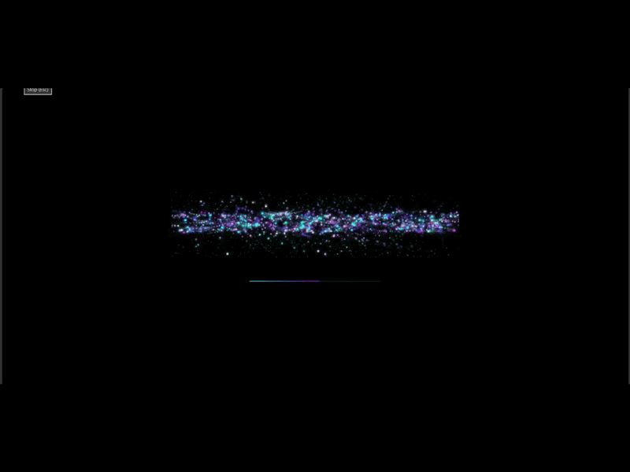

# QUANTUM // FLUX 🌌

> Real-time 3D particle system controlled by hand gestures via webcam.

🔗 **[Live Demo](https://YOUR-USERNAME.github.io/quantum-flux)**

---

<!-- Replace ./demo.gif with your actual screen recording -->


---

<details>
<summary>🟦 Gesture Controls</summary>
<br/>

| Gesture | Action |
|--------|--------|
| ✊ Fist | Switch particle shape |
| ✋ Open Hand | Repel particles |
| 🤏 Pinch | Zoom in / out |

</details>

<details>
<summary>🟣 Particle Formations</summary>
<br/>

| Shape | Color |
|-------|-------|
| ASMI | 🟢 Neon Green |
| Sphere | 🔵 Cyan |
| Cone | 🟣 Purple |
| Torus | 🩷 Pink |
| Heart | 💗 Magenta |

</details>

<details>
<summary>🟩 Run Locally</summary>
<br/>

```bash
git clone https://github.com/YOUR-USERNAME/quantum-flux.git
cd quantum-flux
```

Then just open `index.html` in browser — or use a local server:

```bash
npx serve .
```

> ⚠️ Allow webcam access when browser asks. Works best in Chrome or Edge.

</details>

<details>
<summary>🟧 Built With</summary>
<br/>

- [Three.js r128](https://threejs.org) — 3D WebGL particle rendering
- [MediaPipe Hands](https://mediapipe.dev) — real-time hand tracking
- Vanilla JS + HTML5 Canvas — zero frameworks

</details>

<details>
<summary>🟥 Credits & Attribution</summary>
<br/>

> ⚠️ **This is not my original idea.**
> The concept and visual direction were created by someone else.
> I customised the gestures, shapes, loading animation, and UI — and am sharing this to document what I learned about Three.js and MediaPipe.

- 💡 Original concept — credit to the original creator
- 🤖 Code built with AI assistance via Claude (Anthropic)
- ✏️ Customised and modified by me

</details>
